# Neural Networks

## Neural Networks Approach the Problem

* The idea is to take a large number of handwritten digits, known as training examples and then develop a system which can learn from those training examples.

* Increasing the number of training examples, the network can learn more about handwriting, and so improve its accuracy.

## Key Ideas About Neural Networks

* Including two important types of artificial neuron (the perceptron and the sigmoid neuron), and the standard learning algorithm for neural networks, known as stochastic gradient descent.

* Today, it's more common to use other models of artificial neurons than perceptron.

* The main neuron model used is one called the sigmoid neuron.

# Perceptrons

## How Do Perceptrons Work?

* A perceptron takes several binary inputs, x₁, x₂, …, and produces a single binary output:

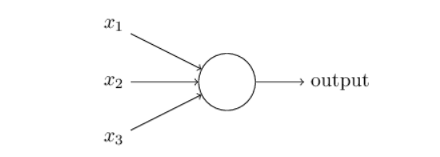

* Weights, w₁, w₂, …, real numbers expressing the importance of the respective inputs to the output. As it increases it indicates that the output really cares about this input.

The neuron's output, 0 or 1, is determined by whether the weighted sum ∑ is less than or greater than some threshold value.

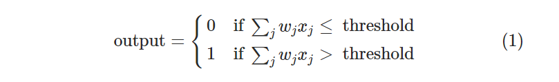

* If the weight of this input is less than the threshold value then the output will not really care about this input.

**Example:**
* If w₁ = 6, w₂ = 2, w₃ = 2
  * Threshold = 5 → output will depend on input 1
  * Threshold = 3 → output will depend on input 1 or both input 2 and 3 together

* By varying the weights and the threshold, we can get different models of decision-making.

## Network

### The First Layer of Perceptrons
* Is making three very simple decisions, by weighing the input evidence.

### The Second Layer of Perceptrons
* Each of those perceptrons is making a decision by weighing up the results from the first layer of decision-making. In this way a perceptron in the second layer can make a decision at a more complex and more abstract level than perceptrons in the first layer.

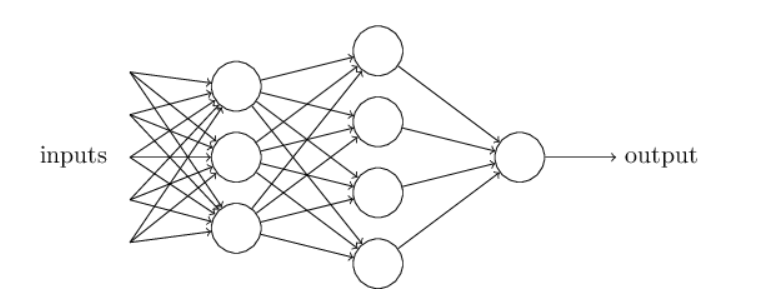

### The Third Layer of Perceptrons
* Even more complex decisions can be made.

In this way, a many-layer network of perceptrons can engage in sophisticated decision making.

## Let's Simplify

Can be written as dot product between w (weights) and x (inputs).

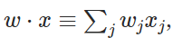

b (bias) ≡ −threshold

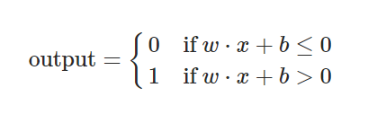

* As bias increases it becomes easier to get output = 1 (less threshold).
* As bias decreases (very negative) it becomes more difficult to get output = 1 (more threshold).

## Another Way Perceptrons Can Be Used

Perceptrons can compute the elementary logical functions. Think of as underlying computation, functions such as AND, OR, and NAND.

**NAND Gate Example:**
* w₁ = -2, w₂ = -2, b = 3
  * 00: -2(0) + -2(0) + 3 = 3 (+ve) → output = 1
  * 01: -2(0) + -2(1) + 3 = 1 (+ve) → output = 1
  * 10: -2(1) + -2(0) + 3 = 1 (+ve) → output = 1
  * 11: -2(1) + -2(1) + 3 = -1 (-ve) → output = 0

* NAND gate is universal so we can build up any computation out of NAND gates.
* So perceptrons are also universal for computation.

## Perceptrons Are Simultaneously Reassuring and Disappointing

* It's reassuring because it tells us that networks of perceptrons can be as powerful as any other computing device.
* It's also disappointing, because it makes it seem as though perceptrons are merely a new type of NAND gate.

## Suggests

* Devise learning algorithms which can automatically tune the weights and biases of a network of artificial neurons. This tuning happens in response to external stimuli, without direct intervention by a programmer.

* We have a network of perceptrons and suppose that a small change in any weight (or bias) causes a small change in the output.

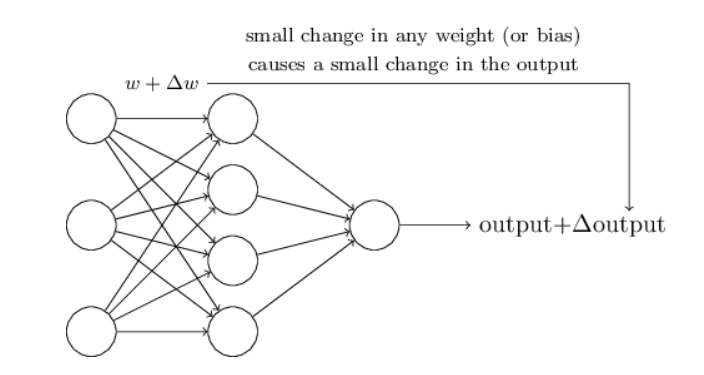

**Example:**
* Network was mistakenly classifying an image as an "8" when it should be a "9"
* We repeatedly change the weights and biases over and over to produce better and better output. The network would be learning.

### Problem
* This isn't what happens when our network contains perceptrons.
* A small change in the weights or bias of any single perceptron in the network can sometimes cause the output of that perceptron to completely flip, say from 0 to 1.

### Overcome
* A new type of artificial neuron called a sigmoid neuron.

# Sigmoid Neurons

## How Do Sigmoid Neurons Work?

* Just like a perceptron, the sigmoid neuron has weights for each input and an overall bias and inputs. But instead of being just 0 or 1, these inputs can also take on any values between 0 and 1.

* But the output is not 0 or 1. Instead, it's σ(w⋅x+b) where σ:

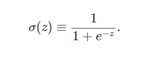

Where z (output of perceptrons):

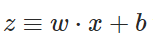

Output:

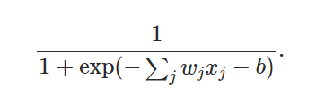

If z:
* Large and positive → e⁻ᶻ ≈ 0 → σ(z) ≈ 1
* Very negative → e⁻ᶻ ≈ ∞ → σ(z) ≈ 0

* The sigmoid function smooths out the sharp transitions of a perceptron, making it easier to train neurons in a network.

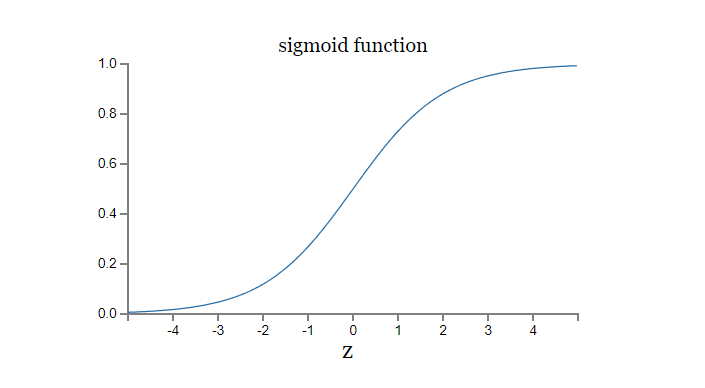

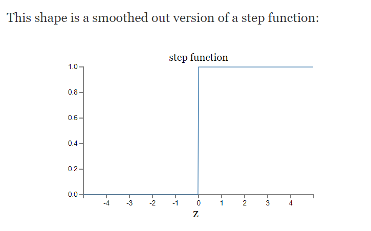

* It allows small, controllable changes to the neuron's output based on small changes in the weights and biases.
* Exact form of the sigmoid is less important than its shape.

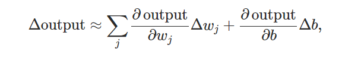

## The Architecture of Neural Networks

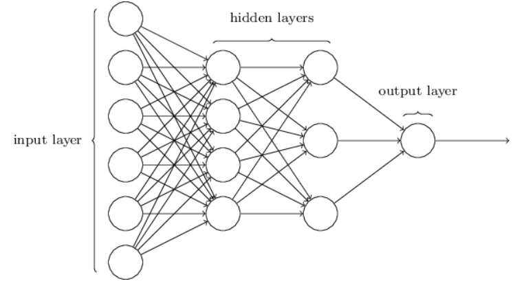

* Can have one or more hidden layers.

* A natural way to design the network is to encode the intensities of the image pixels into the input neurons.
  * If the image is a 64 by 64 greyscale image, then we'd have 4,096 = 64×64 input neurons.
  * Intensities scaled appropriately between 0 and 1.
  * The output layer will contain just a single neuron.
  * The output from one layer is used as input to the next layer.
  * There are no loops (feedforward neural networks) - never fed back.
  * If we did have loops, we'd end up with situations where the input to the σ function depended on the output.

## A Simple Network to Classify Handwritten Digits

Split problem into two sub-problems:

### First, Segmentation
Breaking an image containing many digits into a sequence of separate images, each containing a single digit.

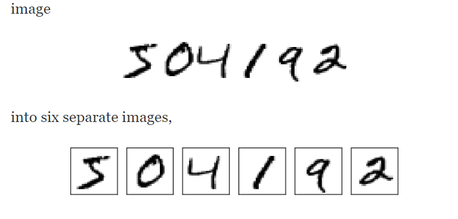

* Scoring depends on if the classifier is confident and accurate with the digit classification.

### Second, Classification
To classify each individual digit (our focus).

To recognize individual digits we will use a three-layer neural network:

* **Input layer:** Contains neurons encoding the values of the input pixels (28 by 28 pixels = 784)
* **Input pixels are greyscale:**
  * 0 = white
  * 1 = black
  * In between = shades of gray
* **Hidden layer:** n layers
* **Output layer:** 10 neurons
  * Output depends on the neuron which has the highest activation value
  * If first output is highest → indicates 0, and so on from (0 to 9)

## Hidden Layer

* First neuron detects whether or not an image like the following is present:

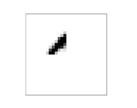

* It can do this by heavily weighting input pixels which overlap with the image, and only lightly weighting the other inputs.

* The second, third, and fourth neurons in the hidden layer detect whether or not the following images are present:

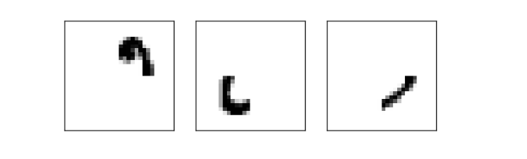

* Four images together make up the 0:

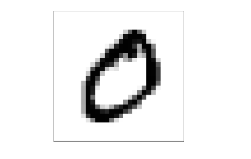

* We can conclude that the digit is a 0 when these 4 hidden neurons fire.

## Why Not Use 4 Outputs?

* Treating each neuron as taking on a binary value: 2⁴ = 16
* The first output neuron would be trying to decide what the most significant bit of the digit was. And there's no easy way to relate that most significant bit to simple shapes.